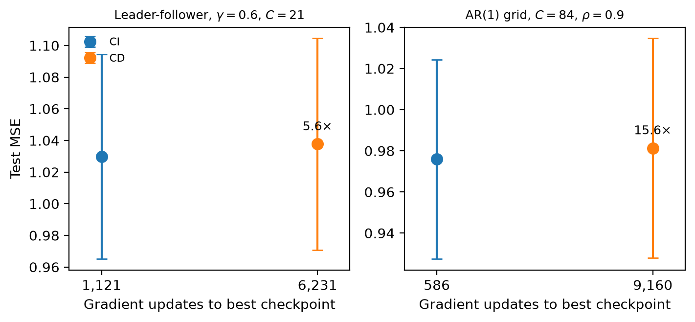

# Channel Dependence in PatchTST under Controlled Coupling

[](https://doi.org/10.5281/zenodo.22859870)
[](LICENSE)
[](pyproject.toml)
[](https://openreview.net/forum?id=aiUZ2y8UNl)

Code, data, and paper for a controlled study of channel-independent (CI) versus
channel-dependent (CD) PatchTST on multivariate time-series forecasting.
Accepted at Transactions on Machine Learning Research (2026), after one
revision round; reviewed on [OpenReview](https://openreview.net/forum?id=aiUZ2y8UNl).

**The full reproduction sweep runs in under a minute on CPU.** Every results file
is verified against a committed digest before any analysis runs, and every
analysis script ends in an oracle check pinned to the values the paper quotes.

[Quick start](#quick-start) · [Key result](#key-result) · [Data](#data) ·
[Reproducing the paper](#reproducing-the-paper) · [Installation](#installation) ·
[Repository layout](#repository-layout) · [Citation](#citation)

## Summary

Comparisons of CI and CD forecasting models are usually run on observational
benchmarks where correlation strength, dimensionality, and temporal dynamics all
vary together, which leaves any single CI win impossible to attribute to one
cause. This project isolates those factors one at a time using synthetic
generative processes with known structure, and treats ETTh1 and ECL as
contextual anchors rather than primary evidence.

Three synthetic families are studied: a factorial AR(1) process with
compound-symmetry covariance (instantaneous correlation only), a leader-follower
VAR(1) process with lag-1 coupling of controllable strength, and a
block-covariance family.

## Key result

Neither mode wins on accuracy once each model is selected fairly. What does not
equalise is cost.

| Quantity | Value |
| --- | --- |
| Grand-mean CD − CI, AR(1) grid, 5 seeds | **+0.0013 MSE** (+0.13% of the CI mean) |
| Seed-clustered 95% confidence interval | [−0.0023, +0.0048] |
| Pre-specified practical-equivalence band | ±1% relative MSE |
| Per-cell 95% detection half-width | 0.0063 MSE (≈0.62% of the CI mean) |
| ECL epoch cost, CD vs CI at the same batch size | ≈956 s vs ≈143 s |
| CD batch size at 84 variates, materialised attention | 1 |



The half-width is the smallest per-cell mean difference whose interval would
exclude zero, so any per-cell CD advantage, where present, is bounded below it:
a measured bound rather than a failure to reject.

A fair-protocol robustness suite — an instrumented selection-rule diagnostic,
matched gradient-update budgets, a cross-variate prediction head, and the
block-covariance family — shows that the apparent CD deficit under lagged
coupling stays inside the 1% band under every selection rule and protocol
variant tried, is comparable to run-to-run variation at five seeds, and is not
produced by checkpoint selection, since the training protocol already restores
validation-best weights.

A closed-form analysis of the generative model shows the near-parity is
expected: at the evaluation horizon the full-information and own-history
Bayes-optimal forecast-error ceilings coincide for every tested coupling
strength. The flattened-token CD formulation, meanwhile, needs smaller feasible
batches and far more gradient steps per epoch — about 4.5 GPU-hours for the
completed H=336 ECL run. On accuracy per unit compute, CI is the better default.

## Quick start

```bash
uv sync --all-groups
uv run python src/reproduce_all.py --tests
```

This verifies every results file against its committed digest, runs the unit
tests, and recomputes every table and figure in the paper, each checked against
the values the paper quotes. It takes under a minute on a CPU.

## Data

> [!IMPORTANT]
> The two real-world datasets are not redistributed here. The notebooks read
> them from a Kaggle input path, and the split conventions are fixed in code.
> Nothing in the reproduction table needs the raw data.

**ETTh1** is the hourly file of the ETT-small collection released with Informer
(Zhou et al., AAAI 2021) at <https://github.com/zhouhaoyi/ETDataset>, whose
LICENSE file is CC BY-ND 4.0. The notebooks read `ETTh1.csv` (17,420 rows,
7 variates after the date column) and use the standard fixed split of
8,640 / 2,880 / 2,880 rows (`TRAIN_END = 8640`, `VAL_END = 11520` in
`train_etth1.ipynb` and `train_etth1_b4.ipynb`).

**ECL** is the 321-client hourly `electricity.csv` distributed with the
Autoformer, Time-Series-Library and iTransformer repositories (THUML), derived
from the UCI ElectricityLoadDiagrams20112014 dataset (Trindade, 2015,
<https://doi.org/10.24432/C58C86>, CC BY 4.0; 370 clients at 15-minute
resolution in the original). The ECL notebook applies the iTransformer
proportions to the row count it finds (`train_end = int(n * 0.6012)`,
`val_end = train_end + int(n * 0.1995)`), which on the 26,304-row file used
gives 15,813 / 5,247 / 5,244 rows; the paper's dataset section records the
26,304 versus 26,352 row-count difference against the iTransformer paper.

Both datasets are z-scored per channel with statistics fitted on the training
split only. The two scripts that read the raw files locally,
`src/analysis/measure_lag_structure.py` (expects `data/ETTh1.csv` and
`data/electricity.csv` under the repository root) and
`src/analysis/partition_etth1_coupling.py` (takes the ETTh1 path as an
argument), write the committed summary files in `results/`.

## Reproducing the paper

Every table and figure is recomputed from a committed CSV in `results/` by one
analysis script. To run the whole set at once, from the repository root:

```bash
python src/reproduce_all.py --tests
```

**Two verification layers.** The runner first checks every `results/*.csv`
against `results/SHA256SUMS` (line endings normalised), failing on any changed,
missing or unlisted file whether or not a script reads it. It then runs the unit
tests and every analysis command, failing on any non-zero exit or any `RESULT:`
line that is not `PASS`. Each analysis script ends in an oracle check pinned to
the values the paper quotes for it, so a changed input fails twice: at the
digest and at the number. The two `derive_*` scripts compare their closed-form
output against the committed file instead.

If a results file changes legitimately, `python src/reproduce_all.py
--write-sums` regenerates the digest file, to be committed alongside it.

> [!NOTE]
> Figure-producing scripts write their PNG into `paper/figures/`. The plotted
> values are fixed by the committed CSVs, but PNG bytes vary across matplotlib
> and font-rendering builds, so a regenerated figure is not expected to be
> byte-identical to the committed one.

The scripts carry the numbers and print them on each run, so the table below
does not restate result values that could drift from the paper; the
[Key result](#key-result) section quotes the headline figures and the scripts
are the source. Paper-position references name the content rather than table
numbers, which the paper's revision renumbered; each script's own header states
the exact table/figure label it feeds.

<details>
<summary><b>Per-experiment commands</b> — 17 scripts, to run individually</summary>

Every script below lives in `src/analysis/` and is run from the repository root,
for example `python src/analysis/analyze_synthetic.py`.

| Paper claim | Script | Reads | Prints / writes |
| --- | --- | --- | --- |
| AR(1) grid table and heatmap | `analyze_synthetic.py` | `results_grid.csv` | per-cell and grand-mean CD-CI, regression; writes `paper/figures/heatmap.png` |
| ETTh1 and ECL tables and figure | `analyze_realdata.py` | `results_etth1.csv`, `results_ecl.csv` | ETTh1 per-horizon paired CD-CI; ECL CI/CD summary; writes `paper/figures/real_data.png` |
| ETTh1 coupling-subgroup contrast | `analyze_etth1_subgroup.py` | `etth1_coupling_partition.csv`, matched-budget ETTh1 window results | high- versus low-coupling subgroup CD-CI with oracle self-check |
| Leader-follower gamma sweep and slope | `analyze_leader_follower.py` | `results_leader_follower.csv` | per-gamma CI, CD, and DLinear means and the gamma slope, with an oracle self-check |
| Boundary patch-size table and heatmap | `analyze_boundary.py` (see note below) | `results_boundary_p4_ci.csv`, `results_boundary.csv`, plus the four P=4 `*_complete.csv` files | per-cell CD-CI across patch sizes and the boundary regression; writes `paper/figures/boundary_heatmap.png` |
| Selection-rule diagnostic and trajectories | `analyze_overtrain.py` | `results_overtrain_summary.csv`, `results_overtrain_diag.csv` | selection-rule effect sizes; writes `paper/figures/diag_overlay_clean.png` |
| Matched-compute control | `analyze_equal_compute.py` | `results_equal_compute.csv` | matched-budget CD-CI with a validity gate on the update budget |
| Cross-variate-head control | `analyze_cd_head.py` | `results_cd_head.csv` | cross-variate-head contrasts against CI and CD |
| Block-covariance family | `analyze_block_cov.py` | `results_block_cov.csv` | block-covariance per-cell CD-CI and the rho_in slope |
| Block-wise attention ablation | `analyze_block_attention.py` | `results_block_attention.csv`, `diag_b5_gamma06.csv` | three-arm CI/CD/CD_Block contrasts and the gradient-norm and participation-ratio diagnostics |
| P=4 boundary cells (all four gamma) | `analyze_boundary_p4.py` | `results_boundary_p4_gamma{0,03,06,09}_complete.csv`, `results_boundary_p4_ci.csv` | per-gamma paired CD-CI at P=4 with oracle self-check |
| C=84 three-arm block-attention cell | `analyze_boundary_c84.py` | `results_grid_C84_block_attn.csv` | CI/CD/CD_Block contrasts at C=84, rho=0.5, with oracle self-check |
| Compute-versus-accuracy figure | `make_compute_accuracy_fig.py --outdir paper/figures` | `results_leader_follower.csv`, `results_grid.csv` | writes `paper/figures/compute_accuracy.png` |
| Attention-memory bound and measured peak | `derive_vram_bound.py` | architecture constants and the measured peak allocations recorded in the script | materialised-attention bound at ECL scale against the measured peak; compares against `results/vram_bound.csv` |
| Practical-equivalence summary | `analyze_equiv_table.py` | `results_grid.csv`, `results_cd_head.csv`, `results_overtrain_summary.csv`, `results_equal_compute.csv`, `results_block_cov.csv` | recomputes all twelve equivalence rows with mean and CI oracle checks; writes `results/equiv_summary.csv` |
| Theoretical forecast-error ceilings | `derive_theoretical_bounds.py` | generates in closed form | CI and CD Bayes-ceiling table; compares against the committed `results/theoretical_bounds.csv` and writes it only if absent |
| Granger non-causality | `validate_granger.py` | generates data internally | Granger non-causality battery (console only) |

All input paths are relative to `results/`. `analyze_boundary.py` resolves its
six input files (the two base CSVs and the four `*_complete.csv` gamma
tranches) automatically when run with no arguments:

```bash
python src/analysis/analyze_boundary.py
```

Pass the six paths explicitly (same order `reproduce_all.py` uses) to point
it at a different results directory. Without the four `*_complete.csv` files
the P=4 row renders as not run and the oracle check fails.

</details>

## Installation

Python 3.12 is the project standard: `requires-python >=3.12,<3.13` is the range
`uv.lock` and the requirements files were resolved for, and the range the tests
and the reproduction sweep were run on. The code uses no feature beyond 3.12;
later interpreters are not covered by the lock file.

With [uv](https://docs.astral.sh/uv/), from the repository root:

```bash
uv sync --all-groups
```

This creates `.venv` on Python 3.12 and installs the exact versions recorded in
`uv.lock`, including the dev tools (pytest, black, flake8).

<details>
<summary>Without uv (pip)</summary>

```bash
python -m venv .venv
.venv\Scripts\activate          # Windows
source .venv/bin/activate       # macOS and Linux
pip install -r requirements.txt
pip install -r requirements-dev.txt   # test and lint tools
```

Both requirements files are generated from `pyproject.toml` by `uv export` (the
generating command is recorded in each file's header) and should not be edited
by hand.

</details>

The runtime stack covers the analysis and plotting code: numpy, pandas, scipy,
statsmodels, matplotlib, and seaborn. torch is included and is needed to import
`src/models.py` and to run the model tests; the analysis scripts that reproduce
every table and figure do not import torch. All analysis runs on CPU.

## Running the tests

```bash
uv run pytest src/tests/          # or: python -m pytest src/tests/
```

With the full environment installed, a clean run reports all tests passed. On a
minimal machine without torch, the model tests skip automatically and the
generator and paired-statistics tests still run, so the suite passes with skips
reported and no failures.

## Results files

`results/` holds every analysis-input CSV, each the committed input to one
analysis script; `equiv_summary.csv`, `theoretical_bounds.csv` and
`vram_bound.csv` are script outputs, committed for reference.

- **[`results/SCHEMA.md`](results/SCHEMA.md)** documents every file, its writer
  and readers, and the meaning of every column, including the conventions that
  hold across files (z-scoring, 1-based `best_epoch`, the `total_steps` and
  `total_steps_to_best` correspondence, and the one file where `total_steps`
  means something else).
- **`results/SHA256SUMS`** carries each file's digest, verified by
  `src/reproduce_all.py` before any analysis runs.
- **`results/logs/`** carries the stdout logs of the completed ECL CI/CD
  training sessions (`ecl_ci_cd_train_resumable_v*_stdout.txt`), the provenance
  for the paper's per-epoch cost figures, and the P=2 feasibility probe log
  (`probe_boundary_p2_stdout.txt`: peak memory and timed-step projection).

## Repository layout

```text
ci-cd-patchtst/
  README.md
  CHANGELOG.md                what changed after the paper's code release
  CITATION.cff
  LICENSE
  mendelowitz2026equalaccuracy.pdf    the accepted paper (camera-ready PDF)
  pyproject.toml              project metadata and dependencies (source of truth)
  uv.lock                     exact pinned resolution (uv)
  requirements.txt            generated by uv export; runtime stack for pip users
  requirements-dev.txt        generated by uv export; pytest, black, flake8
  paper/                      camera-ready LaTeX source, TMLR style files, figures
  src/
    reproduce_all.py          verifies digests, runs the tests and every command
    models.py                 PatchTST CI and CD modes, PatchTST_CD_Head, TrueDLinear
    models_cd_block.py        block-wise cross-variate attention CD variant
    generators/               the three synthetic data generators
    analysis/                 one script per paper table or figure
    probes/                   T4 feasibility probes; measurement only
    tests/                    unit tests
  notebooks/                  training notebooks (Kaggle T4)
    original/                 original boundary training notebooks
  results/                    committed result CSVs, SCHEMA.md, SHA256SUMS, logs/
```

<details>
<summary><b>Per-file detail</b></summary>

```text
  paper/
    main.tex                  camera-ready paper source (TMLR style)
    references.bib
    tmlr.sty, tmlr.bst,       TMLR style files, as distributed by the journal
    fancyhdr.sty
    figures/                  PNGs referenced by main.tex, written by the
                              analysis scripts below
  src/
    models.py                 PatchTST CI and CD modes, the PatchTST_CD_Head
                              cross-variate head, TrueDLinear, and build_model
    models_cd_block.py        block-wise cross-variate attention CD variant
                              (revision)
    generators/
      generate_ar1_grid.py          compound-symmetry AR(1) grid generator
      generate_leader_follower.py   leader-follower VAR(1) generator
      generate_block_cov.py         block-covariance AR(1) generator
    analysis/
      analyze_synthetic.py          AR(1) grid table and heatmap
      analyze_realdata.py           ETTh1 and ECL tables and figure
      analyze_leader_follower.py    leader-follower gamma-sweep table and slope
      analyze_boundary.py           boundary patch-size table and heatmap
      analyze_boundary_p4.py        P=4 boundary cells, all four gamma (revision)
      analyze_boundary_c84.py       C=84 three-arm block-attention cell (revision)
      merge_boundary_p4.py          merges per-slice P=4 result files (revision)
      make_compute_accuracy_fig.py  compute-versus-accuracy figure
      analyze_overtrain.py          selection-rule diagnostic and trajectories
      analyze_equal_compute.py      matched-compute control
      analyze_cd_head.py            cross-variate-head control
      analyze_block_cov.py          block-covariance family
      analyze_block_attention.py    block-wise attention three-arm ablation
      analyze_etth1_subgroup.py     ETTh1 coupling-subgroup contrast
      analyze_equiv_table.py        practical-equivalence summary table
      derive_theoretical_bounds.py  closed-form CI/CD forecast-error ceilings
      derive_vram_bound.py          attention-memory bound derivation and
                                    measured-peak comparison (revision)
      validate_granger.py           Granger non-causality battery
      partition_etth1_coupling.py   ETTh1 coupling-partition scoring (revision)
      paired_stats.py               shared paired-difference library
    probes/                   T4 feasibility probes (P=2 boundary, ECL stage-0,
                              block-attention dry run); measurement only
    tests/
      test_experiments.py
      test_cd_block.py
      conftest.py
  notebooks/
    original/                 original boundary training notebooks, retrieved
                              2026-08-04 (see Notebooks)
  results/
    SCHEMA.md                 every CSV, its writer and readers, every column
    SHA256SUMS                digest of every CSV, checked by reproduce_all.py
    logs/                     stdout logs of the ECL training sessions and the
                              P=2 feasibility probe
```

The cross-variate head is the class `PatchTST_CD_Head` inside `src/models.py`.

</details>

## Notebooks

The `notebooks/` directory holds the training notebooks, each run on a Kaggle T4
GPU, that produced the result CSVs: leader-follower, ETTh1 (original and
matched-budget rerun), ECL (CI/CD resumable), DLinear, cross-variate head, equal
compute, block covariance, the block-wise cross-variate attention ablation
(including its single-cell C=84 AR(1)-grid variant,
`train_grid_c84_block_attn.ipynb`), the AR(1) grid's extra-seed run
(`train_grid_extra_seeds.ipynb`, seeds {789, 1011}), and the boundary P=4
gamma-sweep slices with their config files.

Some notebooks refer to `results_grid.csv` by its earlier name,
`results_grid_canonical.csv`, in their comparison cells; the two are the same
file. The boundary sweep's original notebooks are committed separately under
`notebooks/original/`.

## Reproducing from scratch

Reproducing every table and figure from the committed CSVs needs only the
analysis scripts and the CPU stack installed by `uv sync` or the requirements
files. Retraining the models from raw synthetic data is partially supported: the
training notebooks under `notebooks/` retrain the experiments listed above on a
single T4.

> [!WARNING]
> The AR(1) grid's original seeds cannot be retrained bit for bit from this
> repository. Seeds {42, 123, 456} were trained from series produced by
> `src/generators/generate_ar1_grid.py` (13,400 usable timesteps) in a notebook
> that is not committed; seeds {789, 1011} by
> `notebooks/train_grid_extra_seeds.ipynb`, which carries an inline
> implementation of the same process at 14,400 usable timesteps (the paper's
> protocol table records both lengths). The two implementations draw their
> innovations differently, so they realise the same process from different
> random streams. The notebook retrains the grid for any seed list and series
> length, but does not reproduce the original three seeds' rows bit for bit.

The boundary patch-size sweep's original training notebooks were retrieved on
2026-08-04 from the Kaggle environment in which they ran and are committed
byte-identical under `notebooks/original/` (`train_boundary_*.ipynb`); they are
Kaggle-environment notebooks (T4, `/kaggle/working` paths) covering the original
grid (P in {2, 8, 16}) at n=5 and the original P=4 CI cells at n=3. The full P=4
extension (CD and CI, n=5, across the gamma sweep) was trained by the
revision-era gamma-slice notebooks committed under `notebooks/`, which carry
their own per-epoch checkpoint/resume protocol.

The boundary notebooks define their own data generation and windowing, which
differ from the other engines under `notebooks/`;
`notebooks/original/README.md` records each file's role and SHA256 and the
shared protocol. The three generators under `src/generators/` are committed.

## Citation

```bibtex
@article{mendelowitz2026equalaccuracy,
  title   = {Equal Accuracy, Unequal Cost: Channel Dependence in {PatchTST} under Controlled Coupling},
  author  = {Mendelowitz, Adi},
  journal = {Transactions on Machine Learning Research},
  year    = {2026},
  url     = {https://openreview.net/forum?id=aiUZ2y8UNl},
  note    = {Accepted for publication}
}
```

`CITATION.cff` at the repository root carries the same reference for GitHub's
"Cite this repository" button.

The repository is archived on Zenodo under a single concept DOI,
<https://doi.org/10.5281/zenodo.22859870>, which always resolves to the newest
archived version; each release also has its own version DOI (`v1.0-tmlr`:
10.5281/zenodo.22860170; `v1.2-tmlr`: 10.5281/zenodo.22859871). The paper cites
`v1.0-tmlr`, the state of the repository at camera-ready submission; that state
is archived and will not change. Later releases are listed in
[`CHANGELOG.md`](CHANGELOG.md) and never move that tag. Prefer citing the
concept DOI alongside the tag, since it survives even if GitHub or the
repository itself later disappears.

## License

Code and data in this repository are released under the MIT License; see
[`LICENSE`](LICENSE). The paper itself will be published by TMLR under CC BY
4.0 once the issue is assigned; it is currently accepted, not yet published.
